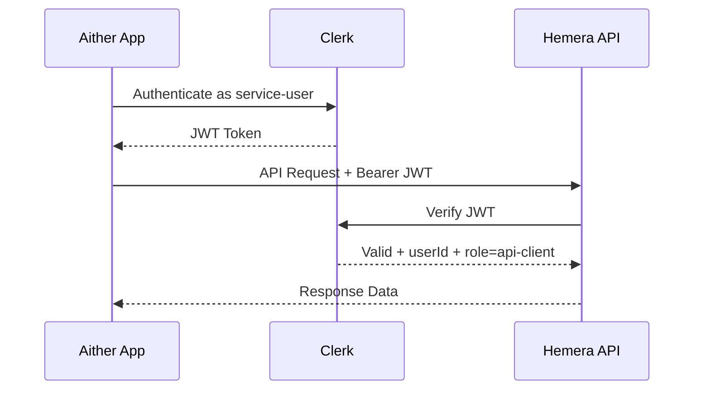

# Aither → Hemera API Integration Plan

## Kontext

Die **Aither-App** (Next.js + Clerk) muss auf die **Hemera API** zugreifen, um:
1. **Seminar-/Kursdaten lesen** (Courses, Bookings, Teilnehmer)
2. **Teilnehmer-spezifische Ergebnisse schreiben** (CourseParticipation-Felder: `resultOutcome`, `resultNotes`)

Beide Apps nutzen Clerk als Auth-Provider.

---

## Empfehlung: Dedizierter Service-User mit Clerk

### Warum NICHT den Admin-Account verwenden?

| Risiko | Beschreibung |
|--------|-------------|
| **Überprivilegierung** | Admin hat Zugriff auf alles - Aither braucht nur Kurs- und Teilnehmerdaten |
| **Audit-Verlust** | Alle Aither-Aktionen erscheinen als Admin-Aktionen im Log |
| **Credential-Kopplung** | Wenn Aither kompromittiert wird, ist der Admin-Zugang betroffen |
| **Session-Konflikte** | Admin-Sessions könnten durch parallele Nutzung gestört werden |

### Empfohlener Ansatz: Clerk JWT + Service-Rolle



### Architektur-Optionen

#### Option A: Clerk Service-User mit eigener Rolle ⭐ Empfohlen

1. **Neuen Clerk-User anlegen** (z.B. `aither-service@hemera-academy.com`)
2. **Eigene Rolle zuweisen** via `publicMetadata`: `{ "role": "api-client" }`
3. **Hemera erweitern**: Neue Rolle `api-client` in `lib/auth/permissions.ts` mit eingeschränkten Rechten
4. **Aither**: Clerk Backend-SDK nutzen, um JWT zu generieren und an Hemera-API zu senden

**Vorteile:**
- Minimale Änderungen an Hemera (nur Rolle + Permissions erweitern)
- Clerk verwaltet Credentials zentral
- Audit-Trail zeigt klar "aither-service" als Akteur
- Gleiche Auth-Infrastruktur wie bestehende User

**Nachteile:**
- Service-User belegt einen Clerk-Seat
- JWT-Refresh muss in Aither gehandhabt werden

#### Option B: Clerk Machine-to-Machine (M2M) Token

1. **Clerk JWT Template** erstellen für Service-Zugriff
2. **API Key** in Clerk Dashboard generieren
3. **Hemera Middleware** erweitern für M2M-Token-Validierung

**Vorteile:**
- Kein User-Seat nötig
- Saubere M2M-Trennung

**Nachteile:**
- Clerk M2M ist ein neueres Feature, erfordert ggf. Plan-Upgrade
- Mehr Middleware-Anpassungen in Hemera nötig

#### Option C: Shared API Key (einfachste Lösung)

1. **API Key** als Environment Variable in beiden Apps
2. **Hemera**: Neuer Middleware-Check für `x-api-key` Header
3. **Aither**: API Key bei jedem Request mitsenden

**Vorteile:**
- Sehr einfach zu implementieren
- Keine Clerk-Abhängigkeit für Service-Kommunikation

**Nachteile:**
- Kein User-Kontext (kein Audit wer genau was tat)
- Key-Rotation muss manuell erfolgen
- Weniger sicher als JWT-basierte Lösung

---

## Empfohlene Implementierung: Option A

### Schritt-für-Schritt Plan

#### 1. Clerk: Service-User anlegen

- Neuen User in Clerk Dashboard erstellen: `aither-service@hemera-academy.com`
- `publicMetadata` setzen: `{ "role": "api-client", "service": "aither" }`

#### 2. Hemera: Neue Rolle `api-client` einführen

**Datei:** `lib/auth/permissions.ts`
- `UserRole` erweitern um `api-client`
- Permissions definieren:
  - `read:courses` ✅
  - `read:bookings` ✅
  - `read:participations` ✅
  - `write:participation-results` ✅
  - `manage:courses` ❌
  - `manage:users` ❌

#### 3. Hemera: Neue API-Endpunkte für Service-Zugriff

Neue Route-Gruppe `app/api/service/` mit:

| Endpunkt | Methode | Beschreibung |
|----------|---------|-------------|
| `/api/service/courses` | GET | Kurse mit Teilnehmerdaten lesen |
| `/api/service/courses/[id]` | GET | Einzelnen Kurs mit Buchungen lesen |
| `/api/service/participations/[id]` | GET | Participation-Details lesen |
| `/api/service/participations/[id]/result` | PUT | Ergebnis-Daten schreiben |

Jeder Endpunkt prüft:
```typescript
const { userId } = await auth();
const role = await getUserRole(); // muss api-client sein
if (role !== 'api-client' && role !== 'admin') {
  return NextResponse.json({ error: 'Forbidden' }, { status: 403 });
}
```

#### 4. Aither: Clerk Backend-SDK für API-Calls

```typescript
// In Aither: Clerk Backend API nutzen
import { clerkClient } from '@clerk/nextjs/server';

// Service-User Token generieren
const token = await clerkClient.sessions.getToken(sessionId, 'hemera-api');

// Hemera API aufrufen
const response = await fetch('https://hemera.example.com/api/service/courses', {
  headers: {
    'Authorization': `Bearer ${token}`,
    'Content-Type': 'application/json',
  },
});
```

#### 5. Hemera: Middleware anpassen

**Datei:** `proxy.ts` - Sicherstellen, dass `/api/service/*` Routen durch Clerk-Auth gehen.

---

## Datenfluss

```mermaid
flowchart LR
    subgraph Aither
        A1[Service Logic]
        A2[Clerk SDK]
    end

    subgraph Clerk
        C1[Service User JWT]
    end

    subgraph Hemera
        H1[/api/service/*]
        H2[Auth Middleware]
        H3[Permissions Check]
        H4[Prisma DB]
    end

    A1 --> A2
    A2 --> C1
    C1 --> H1
    H1 --> H2
    H2 --> H3
    H3 --> H4
```

## Sicherheitsaspekte

- **Principle of Least Privilege**: `api-client` Rolle hat nur die minimal nötigen Rechte
- **Audit Trail**: Alle Aktionen sind dem Service-User zugeordnet
- **JWT-Validierung**: Clerk verifiziert Token-Integrität und -Ablauf
- **Rate Limiting**: Empfehlung, Rate Limiting für `/api/service/*` einzuführen
- **IP-Whitelisting**: Optional, falls Aither von bekannter IP deployed wird

## Geklärte Rahmenbedingungen

| Frage | Antwort |
|-------|---------|
| Hosting | Hemera auf Vercel, Aither lokal/anderer Host |
| Datenzugriff | Nur Kurse + Participations, keine Booking-Details |
| Clerk-Plan | Free/Hobby - kein M2M verfügbar → **Option A bestätigt** |

---

## Implementierungs-Tasks (Hemera-Seite)

- [ ] Clerk: Service-User `aither-service@hemera-academy.com` anlegen und `publicMetadata.role = "api-client"` setzen
- [ ] `lib/auth/permissions.ts`: `UserRole` um `api-client` erweitern mit Permissions `read:courses`, `read:participations`, `write:participation-results`
- [ ] `app/api/service/courses/route.ts`: GET-Endpunkt für Kursliste (mit Teilnehmer-Anzahl)
- [ ] `app/api/service/courses/[id]/route.ts`: GET-Endpunkt für Kursdetails inkl. Participations
- [ ] `app/api/service/participations/[id]/route.ts`: GET-Endpunkt für Participation-Details
- [ ] `app/api/service/participations/[id]/result/route.ts`: PUT-Endpunkt für Ergebnis-Daten schreiben
- [ ] Auth-Guard Helper für `/api/service/*` Routen erstellen (Rolle `api-client` oder `admin` prüfen)
- [ ] Rate Limiting für `/api/service/*` Endpunkte einführen
- [ ] Tests: Contract-Tests für die neuen Service-Endpunkte

## Implementierungs-Tasks (Aither-Seite)

- [ ] Hemera API Client erstellen mit Clerk Backend-SDK JWT-Generierung
- [ ] Environment Variables konfigurieren (`HEMERA_API_URL`, Clerk Service-User Credentials)
- [ ] API-Aufrufe für Kurs- und Participation-Daten implementieren
