# Entity-Relationship-Diagramm: Kursphasen-Tracking

## Übersicht

Dieses Diagramm zeigt die erweiterte Datenbankarchitektur für das Tracking von Teilnehmerdaten in verschiedenen Kursphasen (Vorbereitung, Ergebnisse, Debriefing).

## Mermaid Entity-Relationship-Diagramm

```mermaid
erDiagram
    User ||--o{ Booking : "erstellt"
    User ||--o{ CourseParticipation : "hat"
    User ||--o{ ParticipationDocument : "lädt hoch"
    Course ||--o{ Booking : "hat"
    Course ||--o{ CourseParticipation : "hat"
    Location ||--o{ Course : "hostet"
    Booking ||--o| CourseParticipation : "kann haben"
    CourseParticipation ||--o{ ParticipationDocument : "hat"

    User {
        string id PK
        string name
        string email UK
        datetime emailVerified
        string image
        datetime createdAt
        datetime updatedAt
    }

    Course {
        string id PK
        string title
        string description
        string slug UK
        int price
        string currency
        int capacity
        datetime startDate
        datetime startTime
        datetime endTime
        boolean isPublished
        string instructor
        enum level
        string thumbnailUrl
        string locationId FK
        datetime createdAt
        datetime updatedAt
    }

    Location {
        string id PK
        string slug UK
        string name
        string description
        string address
        string zipCode
        string city
        string email
        string phone
        string website
        string imageUrl
        string roomImageUrl
        float latitude
        float longitude
        datetime createdAt
        datetime updatedAt
    }

    Booking {
        string id PK
        string userId FK
        string courseId FK
        enum paymentStatus
        string stripePaymentIntentId
        string stripeSessionId
        int amount
        string currency
        datetime createdAt
        datetime updatedAt
    }

    CourseParticipation {
        string id PK
        string userId FK
        string courseId FK
        string bookingId FK
        text preparationText
        datetime preparationSubmittedAt
        text resultsText
        datetime resultsSubmittedAt
        text debriefingText
        datetime debriefingSubmittedAt
        enum status
        datetime createdAt
        datetime updatedAt
    }

    ParticipationDocument {
        string id PK
        string participationId FK
        string userId FK
        enum phase
        enum documentType
        string fileName
        string fileUrl
        int fileSize
        string mimeType
        datetime uploadedAt
        datetime createdAt
        datetime updatedAt
    }
```

## Entitätsbeschreibungen

### Bestehende Entitäten

#### User
- Repräsentiert einen registrierten Benutzer der Plattform
- Kann mehrere Buchungen und Kursteilnahmen haben

#### Course
- Repräsentiert einen Kurs mit allen Details
- Kann an einem Location stattfinden
- Hat mehrere Buchungen und Teilnahmen

#### Location
- Repräsentiert einen physischen Veranstaltungsort
- Kann mehrere Kurse hosten

#### Booking
- Repräsentiert eine Kursbuchung mit Zahlungsinformationen
- Verbindet User und Course
- Erzeugt automatisch eine CourseParticipation

### Neue Entität

#### CourseParticipation
- **Zweck**: Speichert teilnehmerspezifische Daten für jede Kursphase
- **Beziehungen**:
  - Gehört zu einem User (Teilnehmer)
  - Gehört zu einem Course
  - Ist mit einer Booking verknüpft
  - Hat mehrere ParticipationDocuments
- **Felder für Kursphasen**:
  - `preparationText`: Text für die Vorbereitungsphase (optional, wenn Dokument hochgeladen)
  - `preparationSubmittedAt`: Zeitstempel der Einreichung
  - `resultsText`: Text für die Ergebnisphase (optional, wenn Dokument hochgeladen)
  - `resultsSubmittedAt`: Zeitstempel der Einreichung
  - `debriefingText`: Text für die Debriefing-Phase (optional, wenn Dokument hochgeladen)
  - `debriefingSubmittedAt`: Zeitstempel der Einreichung
- **Status-Tracking**:
  - `status`: Enum für den Fortschritt (z.B. NOT_STARTED, PREPARATION, IN_PROGRESS, RESULTS, DEBRIEFING, COMPLETED)

#### ParticipationDocument (NEU)
- **Zweck**: Speichert hochgeladene Dokumente (PDFs) für jede Kursphase
- **Beziehungen**:
  - Gehört zu einer CourseParticipation
  - Gehört zu einem User (Uploader)
- **Felder**:
  - `phase`: Enum (PREPARATION, RESULTS, DEBRIEFING) - Zuordnung zur Kursphase
  - `documentType`: Enum (TEXT, PDF) - Art des Inhalts
  - `fileName`: Originaler Dateiname
  - `fileUrl`: URL zum gespeicherten Dokument (z.B. Vercel Blob Storage)
  - `fileSize`: Dateigröße in Bytes
  - `mimeType`: MIME-Type des Dokuments (z.B. application/pdf)
  - `uploadedAt`: Zeitstempel des Uploads

## Beziehungen

1. **User ↔ Booking** (1:N)
   - Ein User kann mehrere Bookings haben
   - Jede Booking gehört zu einem User

2. **Course ↔ Booking** (1:N)
   - Ein Course kann mehrere Bookings haben
   - Jede Booking gehört zu einem Course

3. **Location ↔ Course** (1:N)
   - Eine Location kann mehrere Courses hosten
   - Ein Course kann an einer Location stattfinden (optional)

4. **User ↔ CourseParticipation** (1:N)
   - Ein User kann mehrere CourseParticipations haben
   - Jede CourseParticipation gehört zu einem User

5. **Course ↔ CourseParticipation** (1:N)
   - Ein Course kann mehrere CourseParticipations haben
   - Jede CourseParticipation gehört zu einem Course

6. **Booking ↔ CourseParticipation** (1:0..1)
   - Eine Booking kann eine CourseParticipation haben (optional)
   - CourseParticipation wird erst erstellt, wenn der Nutzer die Vorbereitung startet
   - Ein Nutzer, der nur bucht aber nicht mit der Vorbereitung beginnt, ist kein Teilnehmer

7. **CourseParticipation ↔ ParticipationDocument** (1:N)
   - Eine CourseParticipation kann mehrere Dokumente haben
   - Jedes Dokument gehört zu einer CourseParticipation

8. **User ↔ ParticipationDocument** (1:N)
   - Ein User kann mehrere Dokumente hochladen
   - Jedes Dokument wird von einem User hochgeladen

## Workflow

1. **Buchung**: User bucht einen Course → Booking wird erstellt
2. **Teilnahme-Initialisierung**: Bei erfolgreicher Zahlung → CourseParticipation wird erstellt
3. **Vorbereitung**:
   - User gibt entweder Text ein (`preparationText`) ODER
   - User lädt PDF-Dokument hoch → ParticipationDocument wird erstellt
4. **Kurs**: User nimmt am Kurs teil
5. **Ergebnisse**:
   - User gibt entweder Text ein (`resultsText`) ODER
   - User lädt PDF-Dokument hoch → ParticipationDocument wird erstellt
6. **Debriefing**:
   - User gibt entweder Text ein (`debriefingText`) ODER
   - User lädt PDF-Dokument hoch → ParticipationDocument wird erstellt
7. **Abschluss**: Status wird auf COMPLETED gesetzt

## Vorteile dieser Architektur

1. **Trennung von Concerns**: Buchungsdaten (Booking) sind getrennt von Teilnahmedaten (CourseParticipation)
2. **Flexibilität**:
   - Jede Phase kann unabhängig verwaltet werden
   - Teilnehmer können zwischen Text-Eingabe und Dokument-Upload wählen
3. **Tracking**: Zeitstempel für jede Phase ermöglichen Fortschrittsverfolgung
4. **Skalierbarkeit**:
   - Neue Phasen können einfach hinzugefügt werden
   - Mehrere Dokumente pro Phase möglich
5. **Datenintegrität**: Klare Beziehungen zwischen Entitäten
6. **Medienunterstützung**:
   - Unterstützung für Text und PDF-Dokumente
   - Metadaten für Dokumente (Größe, MIME-Type, etc.)
7. **Audit-Trail**: Vollständige Nachverfolgbarkeit durch Zeitstempel und User-Zuordnung

## Implementierungshinweise

### Dokument-Upload
- Verwendung von Vercel Blob Storage (wie bei Course-Thumbnails)
- Validierung von Dateityp und -größe
- Automatische Generierung von sicheren URLs

### Datenmodell-Flexibilität
- Text-Felder in CourseParticipation bleiben optional
- ParticipationDocument ermöglicht mehrere Dokumente pro Phase
- Enum `documentType` unterscheidet zwischen TEXT und PDF für zukünftige Erweiterungen

### Sicherheit
- Dokumente sind nur für den Uploader und Admins sichtbar
- Zugriffskontrolle über userId und participationId
- Sichere URL-Generierung mit Ablaufdatum möglich
