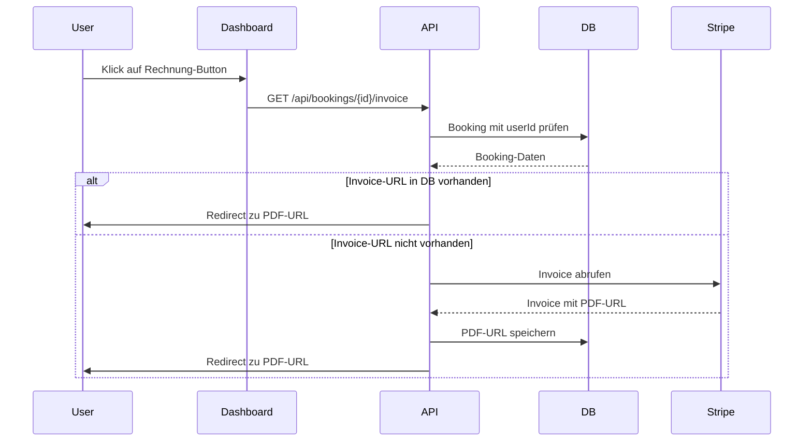
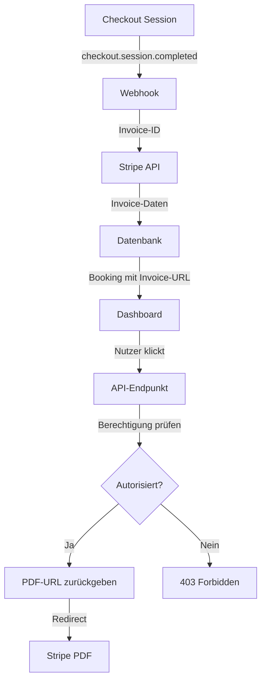

# Stripe-Rechnung als PDF-Download auf Dashboard

## Übersicht

Implementierung eines Features, das es Nutzern ermöglicht, ihre Stripe-Rechnungen für gebuchte Kurse direkt vom Dashboard als PDF herunterzuladen.

## Ziel

Nutzer sollen in der Buchungskachel auf dem Dashboard (`/dashboard`) einen Download-Link für ihre Rechnung sehen, wenn sie einen Kurs mit Status `PAID` gebucht haben.

## Technische Analyse

### Aktuelle Architektur

1. **Dashboard**: [`components/UserDashboard.tsx`](../components/UserDashboard.tsx)
   - Zeigt Buchungen mit Kurs-Titel, Preis und Status
   - Hat bereits einen "Vorbereitung"-Button für bezahlte Kurse
   - Nutzt das [`Booking`](../components/UserDashboard.tsx:36) Interface

2. **Datenbank-Schema**: [`prisma/schema.prisma`](../prisma/schema.prisma:67)
   - Booking-Model hat bereits `stripePaymentIntentId` und `stripeSessionId`
   - Felder für Invoice-Daten fehlen noch

3. **Stripe-Integration**:
   - Webhook: [`app/api/stripe/webhook/route.ts`](../app/api/stripe/webhook/route.ts)
   - Service: [`lib/services/stripe.ts`](../lib/services/stripe.ts)
   - Checkout-Session erstellt automatisch Invoices in Stripe

### Stripe Invoice API

Stripe erstellt automatisch Invoices für erfolgreiche Checkout-Sessions. Diese können über die Stripe API abgerufen werden:

- **Invoice-Objekt**: Enthält `invoice_pdf` URL für direkten PDF-Download
- **Zugriff**: Über `checkout.session.completed` Event oder via Session-ID
- **Speicherung**: Invoice-ID und PDF-URL sollten in der Datenbank gespeichert werden

## Implementierungsplan

### 1. Datenbank-Schema erweitern

**Datei**: [`prisma/schema.prisma`](../prisma/schema.prisma:67)

```prisma
model Booking {
  // ... bestehende Felder
  stripeInvoiceId       String?              @map("stripe_invoice_id")
  stripeInvoiceUrl      String?              @map("stripe_invoice_url")
  stripeInvoicePdfUrl   String?              @map("stripe_invoice_pdf_url")
}
```

**Migration erstellen**:
```bash
npx prisma migrate dev --name add_stripe_invoice_fields
```

### 2. Stripe Webhook erweitern

**Datei**: [`app/api/stripe/webhook/route.ts`](../app/api/stripe/webhook/route.ts:160)

Im `checkout.session.completed` Event-Handler:

```typescript
case 'checkout.session.completed': {
  const session = event.data.object as Stripe.Checkout.Session;
  
  // Bestehender Code...
  
  // NEU: Invoice-Daten abrufen und speichern
  if (session.invoice && bookingId) {
    const stripe = createStripeInstance();
    const invoice = await stripe.invoices.retrieve(
      session.invoice as string
    );
    
    await prisma.booking.update({
      where: { id: bookingId },
      data: {
        stripeInvoiceId: invoice.id,
        stripeInvoiceUrl: invoice.hosted_invoice_url,
        stripeInvoicePdfUrl: invoice.invoice_pdf,
      },
    });
  }
  
  break;
}
```

### 3. Stripe-Service erweitern

**Datei**: [`lib/services/stripe.ts`](../lib/services/stripe.ts)

Neue Methode hinzufügen:

```typescript
/**
 * Retrieve invoice PDF URL
 */
async getInvoicePdfUrl(invoiceId: string): Promise<string | null> {
  try {
    const invoice = await this.ensureStripe().invoices.retrieve(invoiceId);
    return invoice.invoice_pdf || null;
  } catch (error) {
    logError(error, { operation: 'getInvoicePdfUrl', invoiceId });
    return null;
  }
}
```

Export hinzufügen:
```typescript
export const getInvoicePdfUrl = (invoiceId: string) =>
  stripeService.getInvoicePdfUrl(invoiceId);
```

### 4. API-Endpunkt für Invoice-Download

**Neue Datei**: `app/api/bookings/[bookingId]/invoice/route.ts`

```typescript
import { auth } from '@clerk/nextjs/server';
import { NextRequest, NextResponse } from 'next/server';
import { prisma } from '../../../../../lib/prisma';
import { getInvoicePdfUrl } from '../../../../../lib/services/stripe';

/**
 * GET /api/bookings/[bookingId]/invoice
 * Download invoice PDF for a booking
 */
export async function GET(
  request: NextRequest,
  { params }: { params: { bookingId: string } }
) {
  try {
    // 1. Authentifizierung
    const { userId } = await auth();
    if (!userId) {
      return NextResponse.json(
        { success: false, error: 'Unauthorized' },
        { status: 401 }
      );
    }

    // 2. Booking abrufen und Berechtigung prüfen
    const booking = await prisma.booking.findUnique({
      where: { id: params.bookingId },
      include: { course: true },
    });

    if (!booking) {
      return NextResponse.json(
        { success: false, error: 'Booking not found' },
        { status: 404 }
      );
    }

    // 3. Berechtigung prüfen
    if (booking.userId !== userId) {
      return NextResponse.json(
        { success: false, error: 'Forbidden' },
        { status: 403 }
      );
    }

    // 4. Zahlungsstatus prüfen
    if (booking.paymentStatus !== 'PAID') {
      return NextResponse.json(
        { success: false, error: 'Invoice only available for paid bookings' },
        { status: 400 }
      );
    }

    // 5. Invoice-URL abrufen
    let invoicePdfUrl = booking.stripeInvoicePdfUrl;
    
    // Falls nicht gespeichert, von Stripe abrufen
    if (!invoicePdfUrl && booking.stripeInvoiceId) {
      invoicePdfUrl = await getInvoicePdfUrl(booking.stripeInvoiceId);
      
      // In DB speichern für zukünftige Anfragen
      if (invoicePdfUrl) {
        await prisma.booking.update({
          where: { id: booking.id },
          data: { stripeInvoicePdfUrl: invoicePdfUrl },
        });
      }
    }

    if (!invoicePdfUrl) {
      return NextResponse.json(
        { success: false, error: 'Invoice not available' },
        { status: 404 }
      );
    }

    // 6. Redirect zum PDF
    return NextResponse.redirect(invoicePdfUrl);
  } catch (error) {
    console.error('Invoice download error:', error);
    return NextResponse.json(
      { success: false, error: 'Internal server error' },
      { status: 500 }
    );
  }
}
```

### 5. UserDashboard-Komponente erweitern

**Datei**: [`components/UserDashboard.tsx`](../components/UserDashboard.tsx:36)

#### Interface erweitern:

```typescript
interface Booking {
  id: string;
  courseId: string;
  courseTitle: string;
  coursePrice: number;
  currency: string;
  paymentStatus: string;
  createdAt: string;
  stripeInvoicePdfUrl?: string | null;  // NEU
}
```

#### Download-Button hinzufügen:

In der Buchungsliste (Zeile ~580-610), nach dem "Vorbereitung"-Button:

```typescript
<Grid item xs={12} md={3}>
  <Stack
    direction='row'
    spacing={1}
    alignItems='center'
    justifyContent={{ xs: 'flex-start', md: 'flex-end' }}
  >
    {(booking.paymentStatus === 'PAID' ||
      booking.paymentStatus === 'CONFIRMED') && (
      <>
        <Link href='/my-courses' passHref>
          <Button
            variant='outlined'
            size='small'
            endIcon={<ArrowForwardOutlined />}
            sx={{
              borderColor: colors.petrol,
              color: colors.petrol,
              fontFamily: '"Inter", sans-serif',
              fontWeight: 500,
              '&:hover': {
                borderColor: colors.gold,
                backgroundColor: 'rgba(221, 168, 83, 0.1)',
              },
            }}
          >
            Vorbereitung
          </Button>
        </Link>
        
        {/* NEU: Rechnung-Download-Button */}
        <Button
          variant='text'
          size='small'
          startIcon={<DownloadOutlined />}
          onClick={() => {
            window.open(
              `/api/bookings/${booking.id}/invoice`,
              '_blank'
            );
          }}
          sx={{
            color: colors.petrol,
            fontFamily: '"Inter", sans-serif',
            fontWeight: 500,
            '&:hover': {
              backgroundColor: 'rgba(22, 64, 77, 0.05)',
            },
          }}
        >
          Rechnung
        </Button>
      </>
    )}
  </Stack>
</Grid>
```

#### Import hinzufügen:

```typescript
import {
  ArrowForwardOutlined,
  AttachMoneyOutlined,
  CheckCircleOutlined,
  DownloadOutlined,  // NEU
  PendingOutlined,
  SchoolOutlined,
} from '@mui/icons-material';
```

### 6. API-Route für Bookings erweitern

**Datei**: [`app/api/bookings/route.ts`](../app/api/bookings/route.ts)

Sicherstellen, dass `stripeInvoicePdfUrl` im Response enthalten ist:

```typescript
const bookingsWithDetails = bookings.map(booking => ({
  id: booking.id,
  courseId: booking.course.id,
  courseTitle: booking.course.title,
  coursePrice: booking.amount,
  currency: booking.currency,
  paymentStatus: booking.paymentStatus,
  createdAt: booking.createdAt.toISOString(),
  stripeInvoicePdfUrl: booking.stripeInvoicePdfUrl,  // NEU
}));
```

## Sicherheitsüberlegungen

1. **Authentifizierung**: Nur eingeloggte Nutzer können Rechnungen abrufen
2. **Autorisierung**: Nutzer können nur ihre eigenen Rechnungen herunterladen
3. **Zahlungsstatus**: Rechnungen nur für bezahlte Buchungen verfügbar
4. **Rate Limiting**: Sollte für den Invoice-Endpunkt implementiert werden
5. **Stripe-URLs**: Sind zeitlich begrenzt gültig, daher regelmäßig aktualisieren

## Fehlerbehandlung

- **Keine Invoice verfügbar**: Freundliche Fehlermeldung anzeigen
- **Stripe-API-Fehler**: Fallback auf gespeicherte URL
- **Berechtigungsfehler**: 403 Forbidden mit klarer Nachricht
- **Netzwerkfehler**: Retry-Mechanismus implementieren

## Testing

### Unit Tests

1. **API-Endpunkt**:
   - Authentifizierung erforderlich
   - Autorisierung (nur eigene Buchungen)
   - Zahlungsstatus-Prüfung
   - Invoice-URL-Abruf

2. **Stripe-Service**:
   - Invoice-Abruf erfolgreich
   - Fehlerbehandlung bei ungültiger Invoice-ID

### Integration Tests

1. **Webhook-Flow**:
   - Invoice-Daten werden korrekt gespeichert
   - Bestehende Buchungen werden aktualisiert

2. **Dashboard**:
   - Download-Button nur bei bezahlten Kursen sichtbar
   - Klick öffnet PDF in neuem Tab
   - Fehlerbehandlung bei fehlender Rechnung

### E2E Tests

1. Kompletter Buchungsflow mit Invoice-Download
2. Berechtigungsprüfung (anderer Nutzer kann nicht herunterladen)

## Rollout-Plan

### Phase 1: Datenbank & Backend

1. Schema-Migration durchführen
2. Webhook erweitern
3. Stripe-Service erweitern
4. API-Endpunkt implementieren

### Phase 2: Frontend

1. Dashboard-Komponente erweitern
2. UI-Tests durchführen

### Phase 3: Testing & Deployment

1. Integration Tests
2. E2E Tests
3. Staging-Deployment
4. Production-Deployment

## Alternativen & Erweiterungen

### Alternative 1: Eigene PDF-Generierung

- **Pro**: Vollständige Kontrolle über Layout und Inhalt
- **Contra**: Zusätzlicher Entwicklungsaufwand, Wartung

### Alternative 2: Email-Versand

- **Pro**: Nutzer erhalten Rechnung automatisch per Email
- **Contra**: Zusätzliche Email-Infrastruktur erforderlich

### Zukünftige Erweiterungen

1. **Rechnungsarchiv**: Separate Seite mit allen Rechnungen
2. **Mehrwertsteuer**: MwSt.-Berechnung und -Ausweis
3. **Firmendaten**: Möglichkeit, Firmendaten für Rechnung anzugeben
4. **Rechnungsnummern**: Eigene Rechnungsnummern-Logik

## Mermaid-Diagramme

### Sequenzdiagramm: Invoice-Download-Flow



### Datenfluss-Diagramm



### Komponenten-Architektur

```mermaid
graph LR
    A[UserDashboard] -->|API Call| B[/api/bookings]
    A -->|Download Click| C[/api/bookings/id/invoice]
    C -->|Auth Check| D[Clerk]
    C -->|DB Query| E[Prisma]
    C -->|Invoice Fetch| F[Stripe Service]
    F -->|API Call| G[Stripe API]
```

## Offene Fragen

1. **Rechnungsformat**: Soll das Stripe-Standard-Format verwendet werden oder eigenes Design?
   - **Empfehlung**: Zunächst Stripe-Standard, später eigenes Design

2. **Historische Buchungen**: Wie gehen wir mit Buchungen um, die vor dieser Implementierung erstellt wurden?
   - **Empfehlung**: Lazy Loading - Invoice beim ersten Download-Versuch von Stripe abrufen

3. **Caching**: Wie lange sollen Invoice-URLs gecacht werden?
   - **Empfehlung**: Unbegrenzt, da Stripe-URLs langlebig sind

4. **Mehrere Rechnungen**: Was passiert bei Teilzahlungen oder Rückerstattungen?
   - **Empfehlung**: Zunächst nur Haupt-Invoice, später erweitern

## Zusammenfassung

Diese Implementierung ermöglicht es Nutzern, ihre Stripe-Rechnungen direkt vom Dashboard herunterzuladen. Der Ansatz nutzt die bestehende Stripe-Integration und erweitert sie um Invoice-Management. Die Lösung ist sicher, skalierbar und bietet eine gute Nutzererfahrung.

**Geschätzter Aufwand**: 
- Backend: 3-4 Stunden
- Frontend: 2-3 Stunden
- Testing: 2-3 Stunden
- **Gesamt**: 7-10 Stunden

**Priorität**: Mittel (Nice-to-have Feature, verbessert UX)

**Risiken**: 
- Gering: Nutzt bestehende Stripe-Funktionalität
- Stripe-API-Änderungen könnten Anpassungen erfordern
